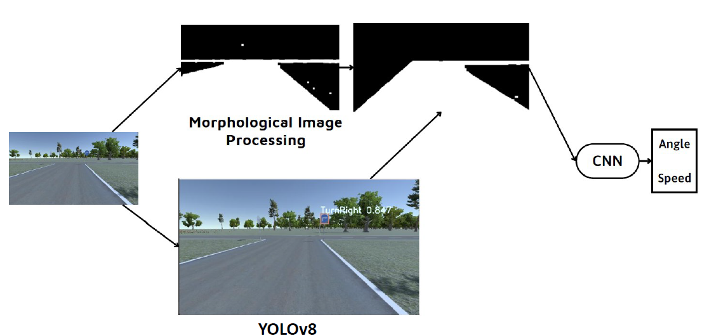

# Self-driving-car
The project focuses on building a driving control model in a simulated environment.

### Simulated environment

The software has two modes:
- User control:
+ The car is controlled by the user.
+ Data collection.

- Autopilot:
+ The car operates automatically.
+ Provides information on steering angle and vehicle speed.
+ The user uses the above two pieces of information and the data from the camera as input for the self-driving car model.

Additionally, the simulated environment also includes various traffic signs that the self-driving car model must recognize in order to control the vehicle and follow the correct route:

### Self-driving car control model

- Input Image: The process starts with an image captured from the car's front camera, showing the road ahead.

- YOLOv8 Object Detection: The image is first processed by a YOLOv8 model, which is likely used to detect objects or features in the image, such as road signs, lane markings, or other vehicles.

- Morphological Image Processing: The output from YOLOv8 is then subjected to morphological image processing techniques. This step likely involves refining the detected features, enhancing certain shapes, or filtering out noise to better understand the road and environment structure.

- Convolutional Neural Network (CNN): The processed image, now with enhanced features and cleaned data, is fed into a CNN. The CNN is responsible for interpreting the processed image data to predict the driving commands.

- Output: The CNN produces two key outputs: the steering angle and the speed of the vehicle. These outputs are then used to control the car's movement in the simulated environment, enabling it to follow the correct path based on the visual inputs.

### Image processing for lane segmentation

The color image is converted to a grayscale image, then thresholding is applied to transform it into a binary image. Morphological image processing is used to eliminate noise from the surrounding environment, such as traffic signs and tree canopies.

### The dataset for training the CNN
The frames, along with their corresponding steering angles and speeds, are recorded to train the CNN.
The frames are saved in a folder named "IMG". 
And a log file with the following structure is created to form the dataset:
| Path to Frame | Steering Angle | Speed |
|---------------|----------------|-------|

### CNN

This architecture is designed to process image data from the vehicle's camera, extract relevant features through convolutional operations, and ultimately determine the appropriate control commands (steering angle and speed) to guide the vehicle autonomously.

### PID controller for car's speed

### Dataset for YOLOv8
Link: [Dataset for YOLOv8](https://universe.roboflow.com/fall-detection-d9pcq/traffic_signs-b44bs/dataset/2)

